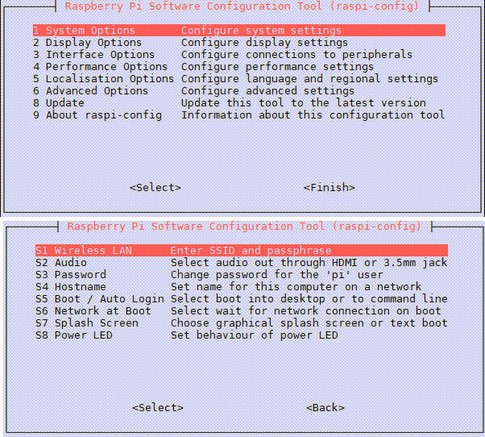

# Getting Started - Use Supplied SD Card Image

Get the car's pi on the local wifi network, and set it up for Python development using the supplied sd card.

This option is useful if you want to maintain the original car functionality through the phone App, and just want to experiment with some Python on the side.

**WARNING:** Back up your original SD image first!

It is easy to mess up the Raspberry Pi wifi configuration.

## On The Car's Pi:

1 - Turn on car's pi, and connect a computer directly to the pi's wifi

This shows is an unsecured network starting with "LABIST".

2 - SSH into the pi

I assume you have a mac or linux terminal. If you are on windows, use Putty or MobaXterm. It should also be possible to log in with an attached keyboard and local monitor.

```
ssh pi@192.168.1.1
password: raspberry
```

Edit wifi settings using raspi-config.
Select "System Options" -> "Wireless Lan"

- Enter the SSID of your local wifi network
- Enter the passphrase of your local wifi network

```
sudo raspi-config
```



Remove execute permissions from the rc.local labist startup script.
This will prevent the pi from assuming the 192.168.1.1 address by default, and enable it to use your router's assigned address.

```
sudo chmod a-x /etc/rc.local
sudo reboot
```

If you get stuck, the following is a nice step by step guide for configuring wifi on a raspberry pi.

- https://www.seeedstudio.com/blog/2021/01/25/three-methods-to-configure-raspberry-pi-wifi/

Log back into the pi after rebooting.

The default hostname is 'raspberrypi'.

```
ssh pi@raspberrypi.local
password: raspberry
```

You may need to log into your router to determine the new IP address given to the pi if the hostname does not resolve to "raspberrypi" as shown above.

3 - Clone this Github repo

```
git clone https://github.com/inactivitytimeout/labists_pi_car.git
cd labists_pi_car
```

4 - Create Virtual Environment

```
python -m venv venv
```

5 - Activate virtual environment

```
source venv/bin/activate
```

6 - Install Python Packages

```
export CFLAGS=-fcommon
pip install RPi.GPIO
pip install smbus2
pip install notebook
```

> **Note** If you see `fatal error: Python.h: No such file or directory` you are missing the Python headers. For Ubuntu or Debian, `sudo apt-get install python3-dev`.
See: https://stackoverflow.com/questions/21530577/fatal-error-python-h-no-such-file-or-directory

7 - Start Jupyter Notebook

```
jupyter notebook --ip 0.0.0.0 --no-browser --port 8888
```

Copy the Jupyter URL links provided in the terminal after running notebook.

## On the PC:

9 - Open Jupyter Notebook (Browser on PC)

- Open a web browser on the PC.

- Paste the URL copied in the step above, containing the host, port, and token.

- Navigate to the "examples" directory and explore the jupyter notebook jupyter_examples.

- Open Python examples and try them
