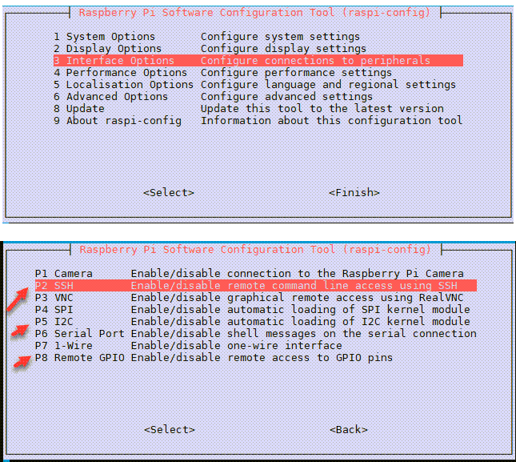

# Getting Started - Fresh Pi OS Install

Get the car's pi on the local wifi network, and set it up for Python development with a fresh Pi OS installation.

This option is useful if you want to start from scratch, and build up your own Python car control from the ground up.

To proceed, you should be comfortable installing a Pi OS, and setting up and using Python.

Put your car's original SD card in a safe place. Use a **different** 16GB SD card for experimenting.

## On The Car's Pi:

1 - Download and install a fresh Raspberry PI OS Image

Install a stock Raspberry PI OS using instructions from the official site.

- https://www.raspberrypi.com/documentation/computers/getting-started.html
- https://projects.raspberrypi.org/en/projects/raspberry-pi-setting-up

The car's Pi will be remotely accessed with SSH, so it must be on the wifi network.

2 - Enable SSH, I2C, Remote GPIO

```
sudo raspi-config
```

Navigate into "Interface Options" to enable SSH, I2C, Remote GPIO.



3 - Set up Pi for SSH access

Set up the Pi for SSH access. There are lots of guides on the internet for this, so I will not cover details. Follow the setup guide below, or find another with google.

- https://www.raspberrypi.com/documentation/computers/remote-access.html#setting-up-an-ssh-server

An alternative to SSH is enabling the Pi's VNC server to access the Pi.

**Note: For subsequent steps, I assume you are logged into the Pi with an SSH session.**

4 - Clone this Github repo

```
git clone https://github.com/inactivitytimeout/labists_pi_car.git
cd labists_pi_car
```

5 - Create Virtual Environment

```
python -m venv venv
```

6 - Activate virtual environment

```
source venv/bin/activate
```

7 - Install Python Packages

```
export CFLAGS=-fcommon
pip install RPi.GPIO
pip install smbus2
pip install notebook
```

8 - Start Jupyter Notebook

```
jupyter notebook --ip 0.0.0.0 --no-browser --port 8888
```

Copy the Jupyter URL links provided in the terminal after running notebook.

## On the PC:

9 - Open Jupyter Notebook (Browser on PC)

- Open a web browser on the PC.

- Paste the URL copied in the step above, containing the host, port, and token.

- Navigate to the "examples" directory and explore the jupyter notebook jupyter_examples.

- Open Python examples and try them
