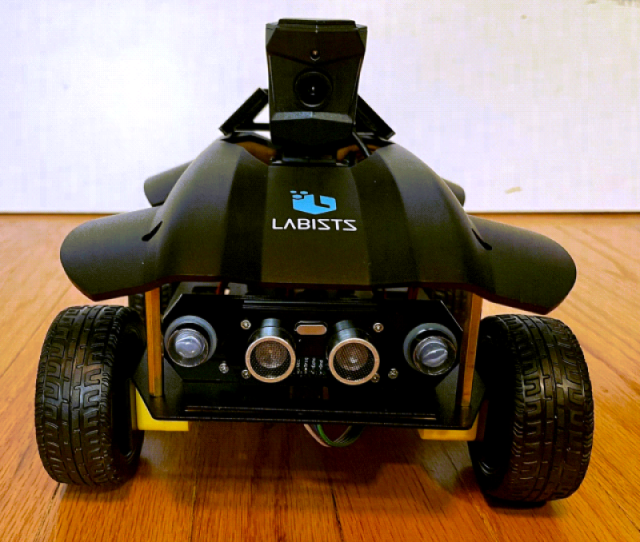

# Python Jupyter Notebook Quick Start for Labists Raspberry Pi Smart Car Kit

The Labists Raspberry Pi Smart Car Kit is a programmable toy car controlled by a Raspberry Pi. I got one from Santa! The car was neat, but missing some key technical documentation and features needed to graduate beyond driving it around with the phone.

## Why Is This Git Repo Useful?

This repo makes experimenting and programming the Labists Smart Car easier. It organizes missing technical details and simple Python [Jupyter Notebook examples](https://github.com/inactivitytimeout/labists_pi_car/tree/main/examples) for learning and experimentation in one place.

The default car kit only comes with a pre-baked SD image for the raspberry pi. Out of the box, the image only supports a phone app, and requires a bluetooth or unsecured wifi connection direct to the car.

Smart Car Kit Limitations:

- The supplied pi image does not connect to your local wifi - makes it's own unsecured wifi network
- Phone app requires connecting directly to car's unsecured wifi network (for camera) or bluetooth
- Difficult to locate and use the car's Python source code

Hopefully the manufacturer will add additional documentation content, and a source code repository in the future as the product matures.

Until then, some technical details and notes from my trial and error experience are captured here.

## Getting Started

To download Python packages and run Jupyter notebooks, the car's pi must be on a local wifi network, with access to the internet. This is not the default configuration and takes some work.

### Option 1 - Use the Supplied SD Card Image

This option is useful if you want to maintain the original car functionality through the phone App, and just want to experiment with some Python on the side.

1. ssh into pi (ip=192.168.1.1, user=pi, password=raspberry)
2. reconfigure wifi for local network
3. Install Python packages
4. Try Jupyter Notebook Python Car Control Examples

Navigate to the getting started page for details.

[GettingStarted.md Details Link](./GettingStarted.md)

### Option 2 - Fresh Raspberry Pi OS Install

This option is useful if you want to start programming from scratch, and build up your own Python car control from the ground up.

1. Install fresh Raspberry Pi OS
2. Install Python packages
3. Try Jupyter Notebook Python Car Control Examples

Navigate to the getting started fresh page for details.

[GettingStartedFresh.md Details Link](./GettingStartedFresh.md)

## Kit Contents

A quick summary of what is (and is not) in the car kit.

[Kit.md Link](./Kit.md)

## Where is the car source code?

I could not locate source code for this kit in a standalone github repo from the manufacturer. Python code lives inside the sd card image and is possible to extract.

[Labists.com - firmware download link](https://labists.com/blogs/download/raspberry-pi-robot-car)

Python source code extraction:

- Follow the above link and download firmware image files
- Use [7-Zip](https://www.7-zip.org/) to extract img files
- Car Python source lives inside 1.img here:
  - /home/pi/work/wifirobots/python_src/hbwz_startmain.py

The Python code is commented in Chinese but easy enough to figure out.

## Technical Notes

The Technical.md document includes technical information for motor control and sensors. This information was put together by trial and error, and is not 100% complete.

- Block diagram
- Pi GPIO connections
- I2C values for motor and sensor control

[Technical.md Link](./Technical.md)

## Links

- [Labists.com - product link](https://labists.com/products/raspberry-pi-smart-car-kit)
- [Labists.com - firmware download](https://labists.com/blogs/download/raspberry-pi-robot-car)
- [Amazon.com](https://www.amazon.com/dp/B09MJZYVFT/)
