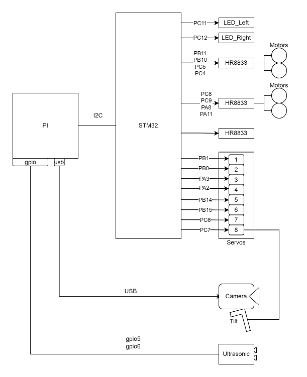

# Technical Notes

I took some notes while figuring out how to control the car in my own Python code. 


## Controller Board Block Diagram




Datasheets
- [STM32F103RCT6 Arm 32-bit microcontroller](./datasheets/stm32f103rct6.en.CD00191185.pdf)
- [HR8833 Motor Controller](./datasheets/HR8833_Datasheet_EN_V2.1.pdf)


## Motor Control and Sensors


### Ultrasonic Sensor
This sensor uses the Pi GPIO. 

```
Echo: GPIO5
Trig: GPIO6
```

### Motor Control

```
I2C - SMBus(1), Address 0x18, Command: 0xFF
-------------------------------------------
I2C Values:

Stop:     0x210A
Forward:  0x220A
Backward: 0x230A
Left:     0x240A
Right:    0x250A

             Slow   ...  Fast
Left Speed:  0x2601 ...  0x260A
Right Speed: 0x2701 ...  0x270A
```

### Headlights

```
I2C - SMBus(1), Address 0x18, Command: 0xFF
-------------------------------------------
I2C Values:

Left Off:  0x3600
Left On:   0x3601
Right Off: 0x3700
Right On:  0x3701
```

### Servos

8 servos are supported - but only #8 (camera tilt) is connected with the kit.

```
I2C - SMBus(1), Address 0x18, Command: 0xFF
-------------------------------------------
I2C Values:

                Low   ...  High
1: No connect  0x0100 ... 0x01FF
2: No connect  0x0200 ... 0x02FF
3: No connect  0x0300 ... 0x03FF
4: No connect  0x0400 ... 0x04FF
5: No connect  0x0500 ... 0x05FF
6: No connect  0x0600 ... 0x06FF
7: Camera Pan  0x0700 ... 0x07FF  <- not in the kit
8: Camera Tilt 0x0800 ... 0x08FF

```

## Camera

The car leverages mjpg-streamer for video display:
- https://github.com/jacksonliam/mjpg-streamer


Build

```
cd $HOME
git clone https://github.com/jacksonliam/mjpg-streamer.git
cd mjpg-streamer/mjpg-streamer-experimental
sudo apt-get install cmake libjpeg9-dev gcc g++
make
```


Starting the video web server:
```
sudo LD_LIBRARY_PATH=`pwd` ./mjpg_streamer -i "./input_uvc.so -d /dev/video0" -o "./output_http.so -p 8080 -w ./www" &
```

On the PC:
http://<car_ip_address>:8080/javascript.html

On the Phone: Edit the <car ip address> in the setup screen.
